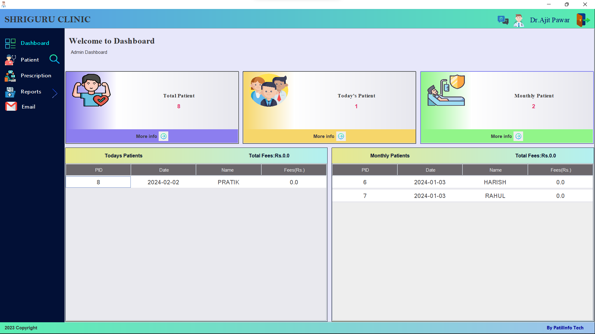
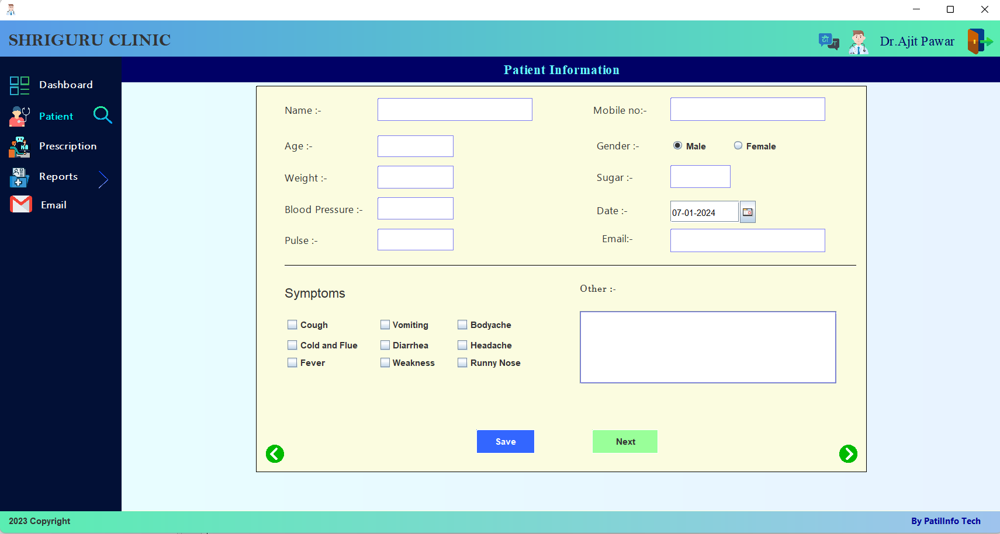
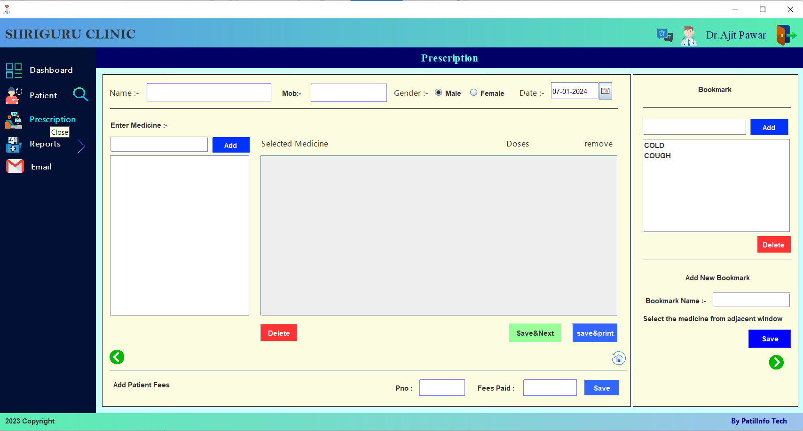
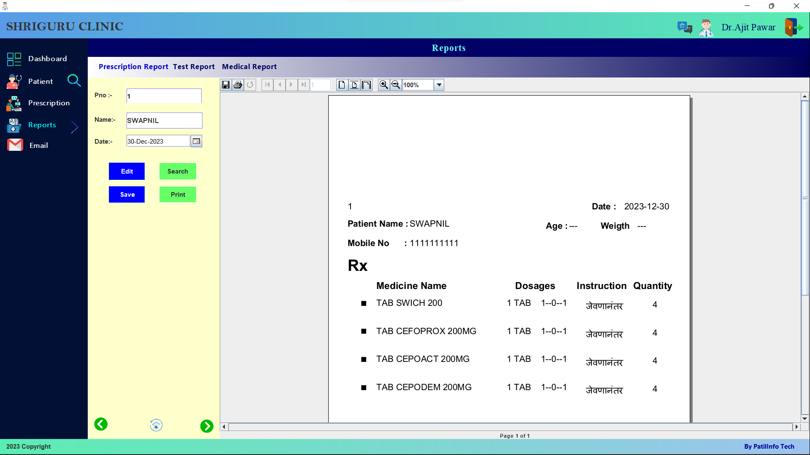
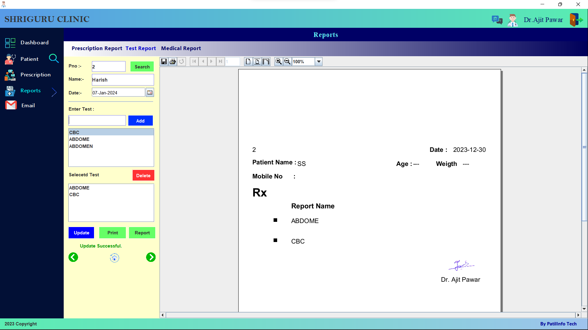
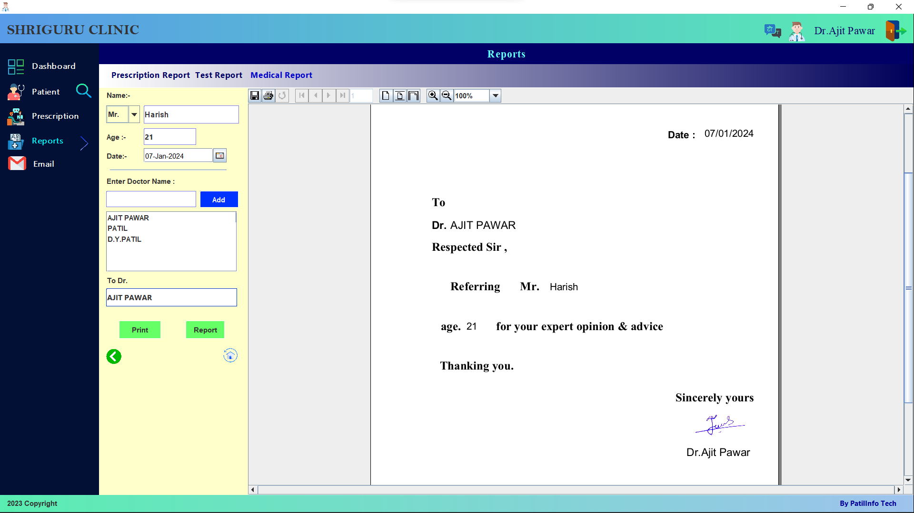
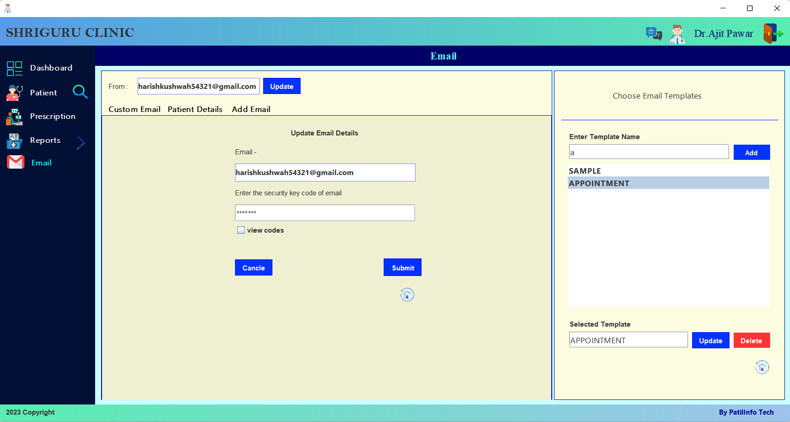

# Hospital Management System
[](https://www.oracle.com/java/technologies/javase-downloads.html)
 [-V7+-green.svg)](https://dev.mysql.com/downloads/mysql/5.7.html)

The Hospital Management System is a Java Swing-based application that allows doctors to manage patient details, prescribe medications, generate reports, and provides a dashboard for an overview of all hospital activities.

## Features

- **Patient Management**: Easily add and manage patient details, including their personal information and medical history.

- **Prescription Management**: Create and manage prescriptions for patients, specifying medications, dosages, and instructions.

- **Report Generation**: Generate reports for patients, prescriptions, and other hospital activities for better record-keeping.

- **Dashboard**: Get a comprehensive overview of hospital activities, including the number of patients, appointments, and prescription records.

## Technologies Used

- Java Swing for the user interface.
- Java for the application logic.
- Postgresql or another database for data storage.
- JasperStudio for report generation

## Getting Started

To run the Hospital Management System on your local machine, follow these steps:

1. Clone the repository:

   ```bash
   git clone https://github.com/Harish-Kushwah/hospital-management.git
   ```

2. Set up your database. You may need to configure the database connection in the project.

3. Open the project in your favorite Java IDE.

4. Compile and run the application.

5. Use the application to manage patient details, prescriptions, and generate reports.

## Usage

Here's a brief overview of how to use the Hospital Management System:

- **Patient Management**: Add patient details.

- **Prescription Management**: Create prescriptions for patients, specifying medications and dosages.

- **Report Generation**: Generate reports for patient records and other hospital activities.

- **Dashboard**: View the dashboard to see an overview of hospital activities.
- **Email**: Send the email to the patients, share report through email.


## Screenshots
Login


SignUp 


Dashboard


Patient


Searching Patient

Prescription


Reports

Prescription Report


Test Report


Medical Report


Email

Using Custom Email


Using Patient Details


Add Email Template


Update Email Credentials


## Contributing

Contributions are welcome! If you'd like to contribute to this project, please follow the guidelines in the [CONTRIBUTING.md](./contribute.md) file.

## License

This project is licensed under the MIT License - see the [LICENSE](LICENSE) file for details.

## Acknowledgments

Thank you to all the contributors and open source projects that have made this project possible.

## Contact

If you have any questions or need assistance, please feel free to contact us:

- Company: [Patil Infotech](mailto:patilinfotech.com)
- Project Link: [click here](https://github.com/Harish-Kushwah/HospitalManagement)

We hope this Hospital Management System is helpful for managing hospital operations efficiently.